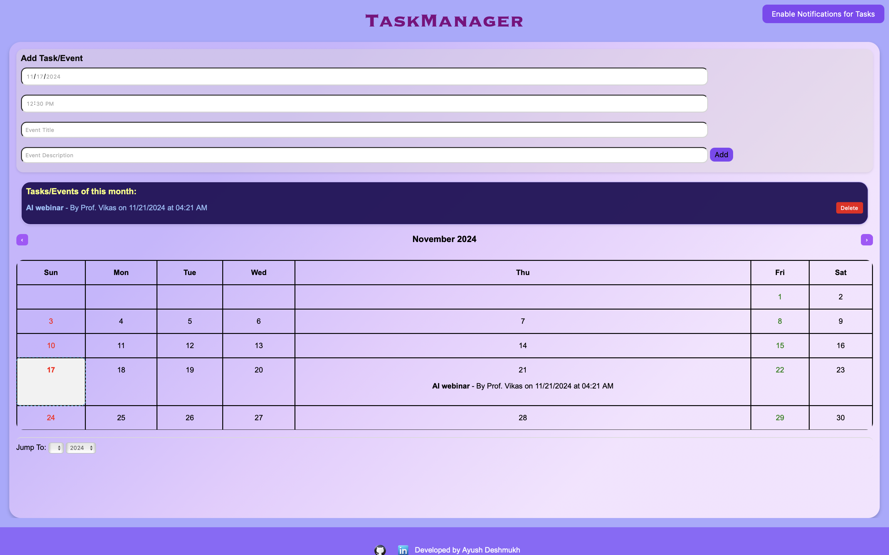

<h1 align="center">   TaskManager: Your Personal Productivity Assistant    </h1>

  <p align="center">
    Elevate your productivity with TaskManager, the ultimate tool for organizing your life.
  </p>
   <p align="center">
    To use the TaskManger , visit this link :(https://ayush1deshmukh.github.io/TaskManager-weekly-Planner/)
  </p>

  <h2 align="center">Key Features</h2>

  <ul>
    <li><strong>Intuitive Task Creation:**</strong> Effortlessly add tasks and set reminders.</li>
    <li><strong>Visual Calendar View:**</strong> Visualize your schedule with a clear and concise calendar.</li>
    <li><strong>Timely Reminders:**</strong> Receive timely notifications to stay on track.</li>
    <li><strong>User-Friendly Interface:**</strong> A clean and intuitive design for a seamless user experience.</li>
    <li><strong>Cross-Platform Compatibility:**</strong> Access your tasks from any device. </li>
  </ul>

  <h2 align="center">Why Choose TaskManager?</h2>

  <ul>
    <li>**Enhanced Organization:** Keep all your tasks and reminders in one place.</li>
    <li> **Reduced Stress:** Minimize stress by staying organized and focused.</li>
    <li>**Improved Efficiency:** Streamline your workflow and boost productivity.</li>
    <li> **Clearer Visual Representation:** Visualize your schedule for better planning and time management.</li>
    <li> **Increased Focus:** Stay on top of your tasks and goals.</li>
  </ul>

  <h2 align="center">Screenshots</h2>

  <div class="screenshot-container">
    
    
  </div>

  <h2 align="center">Getting Started</h2>

  1. **Clone the Repository:**
     ```bash
     git clone [invalid URL removed]
     ```
  2. **Install Dependencies:**
     ```bash
     cd TaskManager
     pip install -r requirements.txt
     ```
  3. **Run the Application:**
     ```bash
     python app.py
     ```

  <h2 align="center">Technologies Used</h2>
<ul>
  <li><strong>Front-End:</strong>
    
    
    
  </li>
</ul>


  <h2 align="center">Contributing</h2>

  We welcome contributions to improve TaskManager! Feel free to fork the repository, make changes, and submit pull requests.

  <h2 align="center">License</h2>

  This project is licensed under the MIT License - see the LICENSE file for details.
